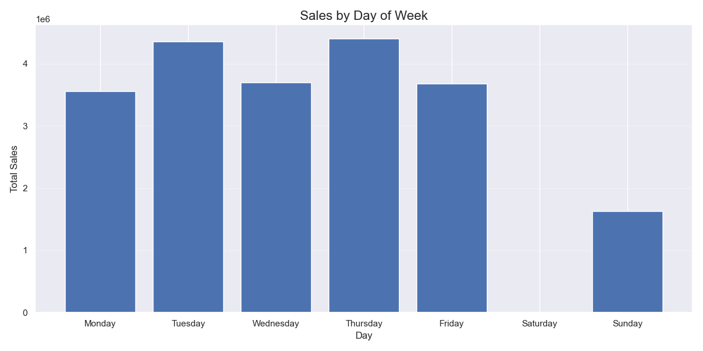

# E-Commerce Sales Analysis

## Project Overview

This project analyzes online retail sales data to uncover business insights and support data-driven decision making. The analysis combines multiple e-commerce datasets, cleans and processes the data, and explores various dimensions of online sales performance.


## Table of Contents

- [Data Sources](#data-sources)
- [Methodology](#methodology)
- [Key Findings](#key-findings)
- [Business Recommendations](#business-recommendations)
- [Technical Implementation](#technical-implementation)
- [Setup & Usage](#setup--usage)

## Data Sources

The analysis utilizes multiple retail datasets obtained from public sources:
- Online Retail dataset (online_retail.xlsx) - Historical transactional data from the UCI Machine Learning Repository (https://archive.ics.uci.edu/ml/datasets/Online+Retail)
- Online Retail II dataset (online_retail_II.csv) - Extended transaction records also from UCI
- E-commerce dataset (e_commerce_data.csv) - Supplementary sales data from Kaggle

> **Note**: The original datasets are publicly available from the [UCI Machine Learning Repository](https://archive.ics.uci.edu/ml/datasets/Online+Retail) and [Kaggle](https://www.kaggle.com). Due to file size limitations, these datasets are not included in this repository. Please download them from the original sources and place them in the `data/raw/` directory to replicate this analysis.

Each dataset contains information about transactions, including:
- Invoice details (date, number)
- Product information (description, stock code)
- Transaction values (quantity, unit price)
- Customer data (customer ID, country)

## Methodology

The analysis followed these key steps:

1. **Data Examination**: Initial inspection of data structures, formats and contents
2. **Data Cleaning**: Processing to handle missing values, standardize formats, and remove anomalies
3. **Data Integration**: Combining multiple datasets to create a unified view
4. **Exploratory Analysis**: Identifying trends, patterns and insights across various dimensions
5. **Visualization**: Creating informative charts and dashboards for business stakeholders



## Key Findings

### Sales Performance

- Total revenue reached a peak of over 3 million in November 2011
- Significant growth began in November 2010, with consistent sales thereafter
- Average monthly sales of approximately 1.5 million after initial growth period

### Temporal Patterns

- Highest sales month: November 2011
- Clear seasonality with Q4 (Oct-Dec) showing higher sales volumes
- Weekday sales pattern shows Tuesday and Thursday as strongest sales days
- Weekend sales significantly lower, with Sunday showing the lowest performance at around 1.6 million in total sales
- Saturday shows minimal sales activity

### Product Analysis

- Top product by revenue: DOTCOM POSTAGE with approximately 400,000 in revenue
- REGENCY CAKESTAND 3 TIER ranks second with about 350,000 in revenue
- PAPER CRAFT, LITTLE BIRDIE ranks third with approximately 325,000
- Top 3 products generate significantly more revenue than other items
- Specialized decorative items dominate the top-selling products

### Geographic Insights

- Dominant market: United Kingdom, representing approximately 18 million in sales
- The UK market is substantially larger than all other markets combined
- Secondary markets include Netherlands, EIRE (Ireland), and Germany, each with less than 1 million in sales
- The top 10 countries show a sharp decline in sales after the UK, indicating heavy market concentration
- European countries dominate the top markets list


## Business Recommendations

Based on the analysis, we recommend the following strategies:

1. **Product Portfolio Optimization**
   - Increase inventory of top-performing products, especially DOTCOM POSTAGE and REGENCY CAKESTAND 3 TIER
   - Develop complementary products to the top performers
   - Evaluate low-performing products for potential discontinuation

2. **Market Development**
   - Maintain strong focus on the UK market as the primary revenue source
   - Develop targeted marketing campaigns for Netherlands, Ireland, and Germany to increase market share
   - Investigate reasons for low penetration in other European markets that show potential

3. **Seasonal Strategy**
   - Plan inventory increases for Q4, especially October-November
   - Develop promotions to boost December sales, which show a decline after November peak
   - Create counter-seasonal products and promotions to balance revenue in slower months

4. **Day-of-Week Optimization**
   - Concentrate marketing efforts and promotions on Tuesday and Thursday to capitalize on peak shopping days
   - Develop special weekend promotions to increase Saturday and Sunday sales
   - Optimize staffing and operations to align with weekly sales patterns


## Technical Implementation

This project demonstrates proficiency in:

- **Python Data Science Stack**: Pandas, NumPy, Matplotlib, Seaborn
- **Data Processing**: Cleaning, transformation, and integration of multiple data sources
- **Statistical Analysis**: Temporal analysis, cohort analysis, correlation studies
- **Data Visualization**: Creation of insightful charts and interactive dashboards
- **Workflow Automation**: End-to-end automated pipeline for repeatable analysis

The analysis is structured into modular components:

```
online-sales-analysis/
├── data/
│   ├── raw/                # Original datasets
│   └── cleaned/            # Processed data
├── code/
│   ├── data_check.py       # Dataset examination
│   ├── data_cleaning.py    # Data cleaning processes
│   ├── data_merging.py     # Dataset integration
│   └── data_analysis.py    # Core analytical functions
├── reports/                # Generated CSV reports
├── visualizations/         # Output charts and graphs
├── main.py                 # Pipeline orchestration
└── sales_analysis.ipynb    # Interactive analysis notebook
```

## Setup & Usage

### Prerequisites

- Python 3.8+
- Required packages: pandas, numpy, matplotlib, seaborn, jupyter

### Installation

```bash
# Create virtual environment
python -m venv venv

# Activate environment
source venv/bin/activate  # Linux/Mac
venv\Scripts\activate     # Windows

# Install dependencies
pip install pandas numpy matplotlib seaborn jupyter
```

### Running the Analysis

1. Download original datasets from UCI Machine Learning Repository and Kaggle
2. Place raw data files in `data/raw/` directory
3. Run the main analysis pipeline:
   ```bash
   python main.py
   ```
4. View generated reports in `reports/` directory
5. Explore visualizations in `visualizations/` directory
6. For interactive analysis, open the Jupyter notebook:
   ```bash
   jupyter notebook sales_analysis.ipynb
   ```

## Future Enhancements

- Implement predictive modeling for sales forecasting
- Develop customer segmentation using clustering techniques
- Create automated reporting system with scheduled updates
- Integrate with BI tools for executive dashboards

---

## Contact

For questions or feedback, please contact:

[Nugrah Salam] - [ompekp@gmail.com]

---

*This project was developed as part of a data analysis portfolio demonstrating professional data cleaning, analysis, and visualization skills.*
