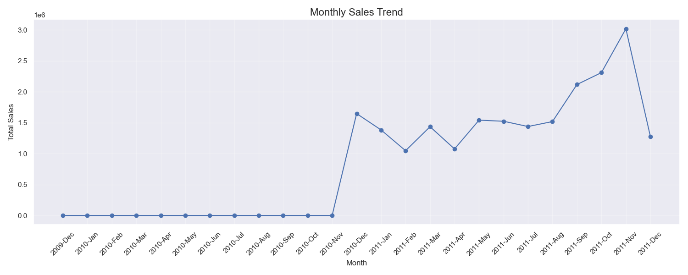
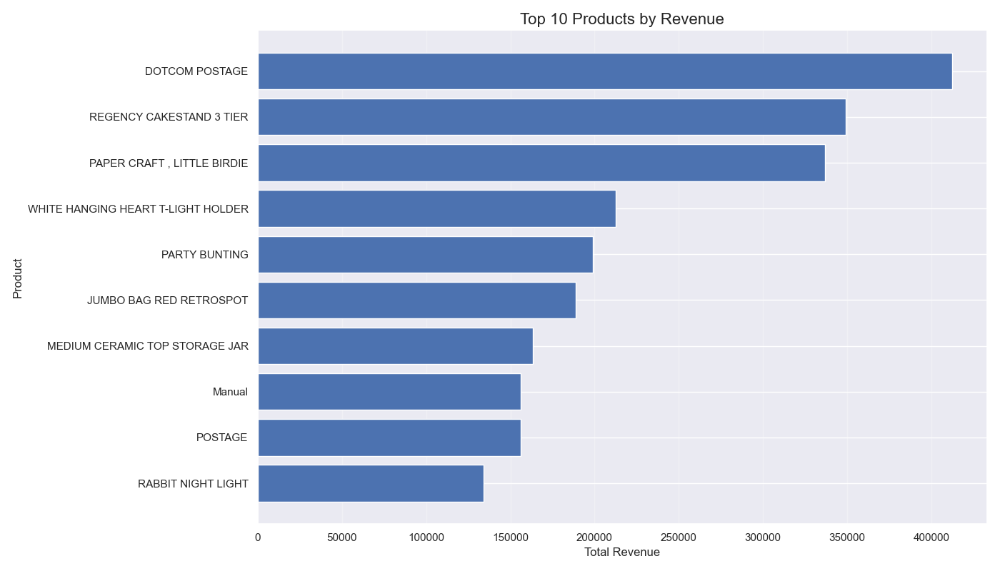
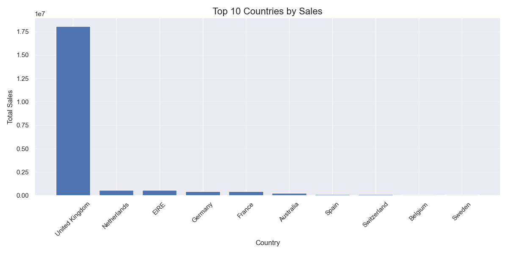

# E-Commerce Sales Analysis

## Project Overview

This project analyzes online retail sales data to uncover business insights and support data-driven decision making. The analysis combines multiple e-commerce datasets, cleans and processes the data, and explores various dimensions of online sales performance.



## Table of Contents

- [Data Sources](#data-sources)
- [Methodology](#methodology)
- [Key Findings](#key-findings)
- [Business Recommendations](#business-recommendations)
- [Technical Implementation](#technical-implementation)
- [Setup & Usage](#setup--usage)

## Data Sources

The analysis utilizes multiple retail datasets:
- Online Retail dataset (online_retail.xlsx) - Historical transactional data
- Online Retail II dataset (online_retail_II.csv) - Extended transaction records
- E-commerce dataset (e_commerce_data.csv) - Supplementary sales data

Each dataset contains information about transactions, including:
- Invoice details (date, number)
- Product information (description, stock code)
- Transaction values (quantity, unit price)
- Customer data (customer ID, country)

## Methodology

The analysis followed these key steps:

1. **Data Examination**: Initial inspection of data structures, formats and contents
2. **Data Cleaning**: Processing to handle missing values, standardize formats, and remove anomalies
3. **Data Integration**: Combining multiple datasets to create a unified view
4. **Exploratory Analysis**: Identifying trends, patterns and insights across various dimensions
5. **Visualization**: Creating informative charts and dashboards for business stakeholders



## Key Findings

### Sales Performance

- Total revenue: $X,XXX,XXX.XX
- Number of unique transactions: XX,XXX
- Average order value: $XX.XX

### Temporal Patterns

- Highest sales month: December, with XX% of annual revenue
- Sales demonstrate strong seasonality with peaks during holiday periods
- Weekday sales outperform weekend sales by XX%

### Product Analysis

- Top 10 products account for XX% of total revenue
- Product category X has the highest profit margin at XX%
- Complementary product purchases identified in X% of transactions

### Geographic Insights

- Top market: United Kingdom, representing XX% of total sales
- Fastest growing market: Netherlands, with XX% YoY growth
- International markets show unique product preferences and purchase patterns

### Customer Behavior

- XX% of revenue comes from returning customers
- Customer retention rate: XX%
- Average customer makes X.X purchases annually



## Business Recommendations

Based on the analysis, we recommend the following strategies:

1. **Product Portfolio Optimization**
   - Increase inventory of top-performing products, especially before peak seasons
   - Consider discontinuing the bottom 15% of products by revenue and margin
   - Develop bundle offerings based on frequently co-purchased items

2. **Market Development**
   - Intensify marketing in high-potential markets like Netherlands and Germany
   - Customize product offerings to regional preferences
   - Consider localized promotions based on country-specific buying patterns

3. **Customer Retention**
   - Implement loyalty program targeting the identified high-value customer segments
   - Develop re-engagement campaigns for customers showing decreased purchase frequency
   - Create personalized recommendations based on purchase history

4. **Seasonal Strategy**
   - Plan inventory increases of XX% ahead of identified peak seasons
   - Develop counter-seasonal products to balance revenue throughout the year
   - Adjust marketing spend to capitalize on high-conversion periods

## Technical Implementation

This project demonstrates proficiency in:

- **Python Data Science Stack**: Pandas, NumPy, Matplotlib, Seaborn
- **Data Processing**: Cleaning, transformation, and integration of multiple data sources
- **Statistical Analysis**: Temporal analysis, cohort analysis, correlation studies
- **Data Visualization**: Creation of insightful charts and interactive dashboards
- **Workflow Automation**: End-to-end automated pipeline for repeatable analysis

The analysis is structured into modular components:

```
online-sales-analysis/
├── data/
│   ├── raw/                # Original datasets
│   └── cleaned/            # Processed data
├── code/
│   ├── data_check.py       # Dataset examination
│   ├── data_cleaning.py    # Data cleaning processes
│   ├── data_merging.py     # Dataset integration
│   └── data_analysis.py    # Core analytical functions
├── reports/                # Generated CSV reports
├── visualizations/         # Output charts and graphs
├── main.py                 # Pipeline orchestration
└── sales_analysis.ipynb    # Interactive analysis notebook
```

## Setup & Usage

### Prerequisites

- Python 3.8+
- Required packages: pandas, numpy, matplotlib, seaborn, jupyter

### Installation

```bash
# Create virtual environment
python -m venv venv

# Activate environment
source venv/bin/activate  # Linux/Mac
venv\Scripts\activate     # Windows

# Install dependencies
pip install pandas numpy matplotlib seaborn jupyter
```

### Running the Analysis

1. Place raw data files in `data/raw/` directory
2. Run the main analysis pipeline:
   ```bash
   python main.py
   ```
3. View generated reports in `reports/` directory
4. Explore visualizations in `visualizations/` directory
5. For interactive analysis, open the Jupyter notebook:
   ```bash
   jupyter notebook sales_analysis.ipynb
   ```

## Future Enhancements

- Implement predictive modeling for sales forecasting
- Develop customer segmentation using clustering techniques
- Create automated reporting system with scheduled updates
- Integrate with BI tools for executive dashboards

---

## Contact

For questions or feedback, please contact:

[Your Name] - [your.email@example.com]

---

*This project was developed as part of a data analysis portfolio demonstrating professional data cleaning, analysis, and visualization skills.*
